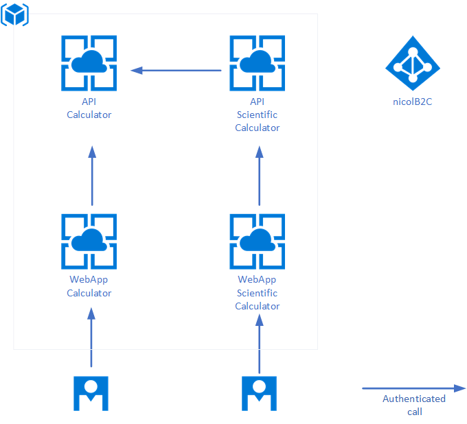
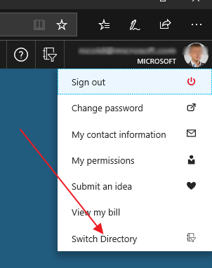

# Azure-B2C-playground

Objective for this lab is to build a playground where to test various authentication and integration scenarios on Azure B2C.

We will configure a Tenant B2C for the company _NicolCorp_ where we will store all customer's user profiles. Once configured we will setup the following Web Applications:

* 	**NicolAPICalculator**: an authenticated WebAPI that implements simple calculation
* 	**NicolAPIScientificCalculator**: an authenticated WebAPI that allows basic scientific calculation. It uses Api exposed by NicolAPICalculator
* 	**NicolWebCalculator**: an ASP.NET MVC Web Application that allows user to perform simple calculations. It uses NicolAPICalculator via backend.

we will also show how access to these API from_

* A Mobile App developed with Xamarin
* Postman

As shown in the image below:

where there is a "double jump" (i.e. user access to WebApp that access to Scientific Calculator API that that access to Calculator API) user impersonation will be keeped on all the chain. 

# Setup Azure AD B2C Instance

The first step is provision a B2C instance. Go to https://portal.azure.com/#create/hub, find and select "Azure Active Directory B2C". You'll need to enter an organization name, the domain name (.onmicrosoft.com), and the country or region of your organization. This determines the datacenter for your directory.

In my environment I have used:

* 	**Organization**: NicolCorp-B2C-Playground
* 	**Domain**: nicolb2c.onmicrosoft.com
* 	**Country**: Italy
	
Once configured remember that you can switch from your B2C tenant to another using the user menu on the top right of the Azure Portal.

# Azure Resources Setup

The next step is to create the remaining objects in Azure:

* **Resource Group**: nicolcorp-b2c-playground - will contain all the resources involved in the plan
* **AppService Plan**: nicolplan-b2c 
* **WebApp**: NicolWebCalculator.azurewebsites.net (OS: Windows)
* **WebApp**: NicolAPICalculator.azurewebsites.net (OS: Windows)
* **WebApp**: NicolAPIScientificCalculator.azurewebsites.net (OS: Windows)
 
the result is the following:

# Next Steps

1. [Setup NicolAPICalculator](setup-apicalculator.md)
	1. [Access API from Xamarin Forms Client App](setup-apicalculator-xamarin.md)
2. [Setup NicolAPIScientificCalculator](setup-apiscientificcalculator.md)
3. [Setup NicolWebCalculator](setup-webcalculator.md)
4. Configure Postman [to call the APIs](setup-postman.md)