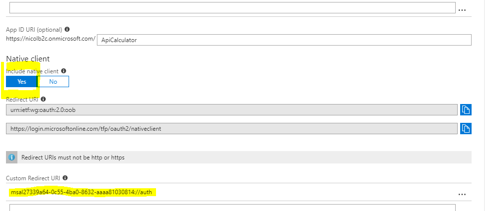

# Build a NicolAPICalculator mobile client

Objective of this step-by-step is to build a xamarin forms client able to access to NicolAPICalculator. The client will use MSAL to authenticate the user, then it will execute basic functions with the API.

# Create a Xamarin Forms starting app
From Visual Studio, create a new project of type - Mobile App (Xamarin Forms) - you can also choose to have a classic iOS or Android App, but using forms, you will reduce the quantity of specific platform code. Select

1. black app
2. Android and iOS only
3. code sharing - .NET Standard

# Configure NicolAPICalculator for Mobile app access

Enable the Native Client setting for the application.
Set the Custom Redirect URI for your app to msal[Application Id]://auth.
use NicolAPICalculator ApplicationID in the place of APPLICATIONID

# Configure Android Project

Open AndroidManifest.xml and add/update the <<appliction>> element as the following:

	<application>
		<activity android:name="microsoft.identity.client.BrowserTabActivity">
			<intent-filter>
				<action android:name="android.intent.action.VIEW" />
				<category android:name="android.intent.category.DEFAULT" />
				<category android:name="android.intent.category.BROWSABLE" />
				<data android:scheme="msal[**APPLICATIONID**]" android:host="auth" />
			</intent-filter>
		</activity>
	</application>

use NicolAPICalculator ApplicationID in the place of APPLICATIONID

Include the package Microsoft.Identity.Client (MSAL) on all projects (Common, iOS, Android), it's a pre-release so remember to set incluede pre-release flag on NuGet.

Now go to App.xaml.cs and initialize a PublicClientApplication instance from MSAL.

	// Azure AD B2C Coordinates
	public static string Tenant = "nicolb2c.onmicrosoft.com";
	public static string ClientID = "27339a64-0c55-4ba0-8632-aaaa81030814";
	public static string PolicySignUpSignIn = "B2C_1_signin-default";
	
	public static string[] Scopes = { "https://nicolb2c.onmicrosoft.com/ApiCalculator/user_impersonation" };
	public static string ApiEndpoint = "https://nicolwebcalculator.azurewebsites.net/api/calc/";
	public static string AuthorityBase = $"https://login.microsoftonline.com/tfp/{Tenant}/";
	
	public static string Authority = $"{AuthorityBase}{PolicySignUpSignIn}";
        public App ()
		{
			InitializeComponent();
	
            // default redirectURI; each platform specific project will have to override it with its own
            PCA = new PublicClientApplication(ClientID, Authority);
            PCA.RedirectUri = $"msal{ClientID}://auth";
	
            MainPage = new MainPage();
		}

Almost ready, on MainPage.xaml.cs you have to manage the authentication flow and the API Call

# Authentication and API CALL
the authentication is managed by one line of code:

	AuthenticationResult ar = await App.PCA.AcquireTokenAsync(App.Scopes, GetUserByPolicy(App.PCA.Users, App.PolicySignUpSignIn), App.UiParent);

it opens the browser and asks for username and password.
once authenticated is possibile to call the API using the following code:

	// Acquire Access token
	AuthenticationResult ar = await App.PCA.AcquireTokenSilentAsync(App.Scopes, GetUserByPolicy(App.PCA.Users, App.PolicySignUpSignIn), App.Authority, false);
	string token = ar.AccessToken;
	
    // Get data from API
    HttpClient client = new HttpClient();
    HttpRequestMessage message = new HttpRequestMessage(HttpMethod.Get, apicall);
    message.Headers.Authorization = new System.Net.Http.Headers.AuthenticationHeaderValue("Bearer", token);
    HttpResponseMessage response = await client.SendAsync(message);
    string responseString = await response.Content.ReadAsStringAsync();

