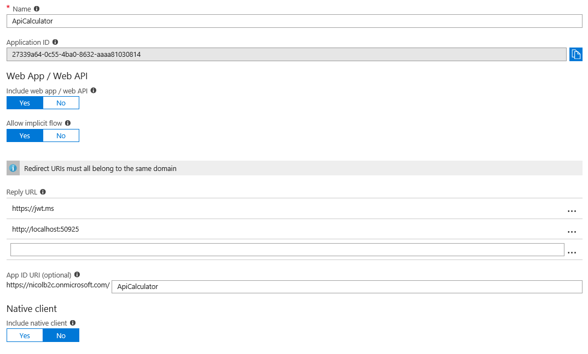
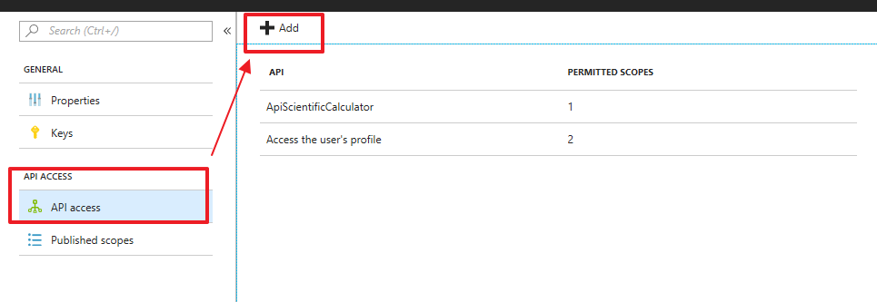
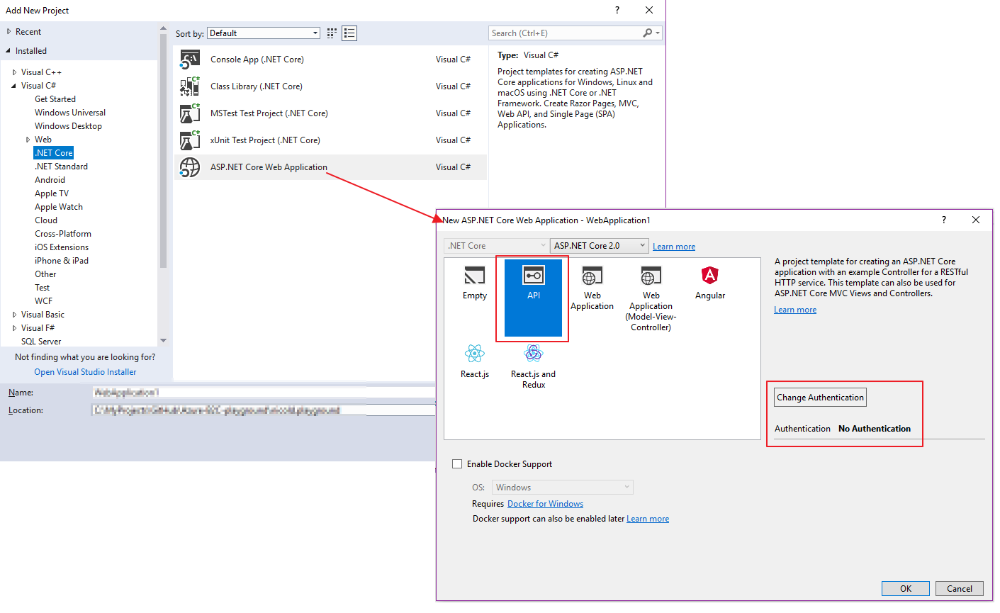
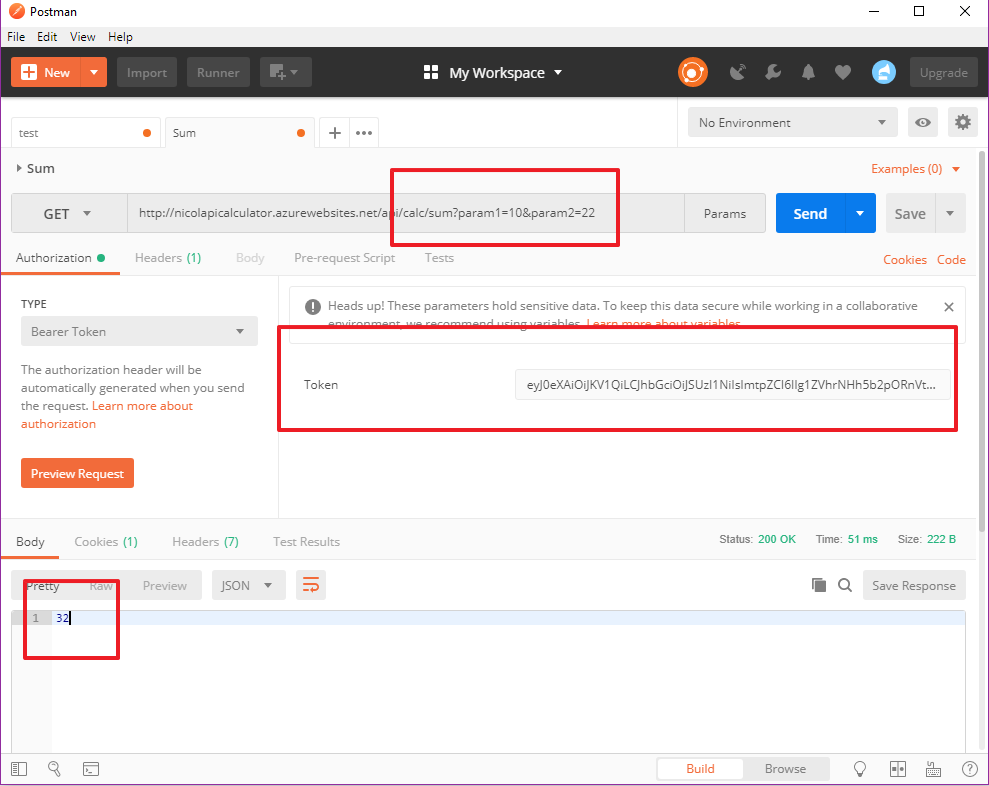

# Setup NicolAPICalculator

Objective of this API is to expose the standard 4 operations (+, -, *, /) as authenticathed API.
In this walktrough we will configure a dot net core api including the configuration for Azure B2C tenant.


# (1) Azure B2C Configuration
Create an application on Azure B2C as shown follow.


  
**Note**: https://jws.ms allows you to read easily the bearer, so that you can copy it in Postman or curl.

After creating it, select "Api access". Click the "Add" button. In the next blade, select the API (ApiCalculator) and as permission "Access this app on behalf of the signed-in user". This is the permissions you would like to grant your client application.



# (2) create a ASP Net Core API not authenticated
Via visual studio create a solution of type "ASP.NET Core Web Application", type API, with NO Authentication



# (3) Create a policy: B2C\_1\_signin-default

On Azure Portal, on Azure AD B2C Service go to

* Sign-up or sign-in policies
* Add and name it "B2C\_1\_signin-default"


In Azure AD B2C, every user experience is defined by a policy. You have to create a policy in order to control the specific look and feel, use of MFA, information the app receive from AD B2C etc.

# (4) Configure appsettings.json and solution for authentication

In appsettings.config add the following information:

	"AzureAdB2C": {
	"Tenant": "nicolb2c.onmicrosoft.com",
	"ClientId": "<the application id (guid)>",
	"Policy: "B2C_1_signin-default"
	},

also add following nuget packages to the solution

	Microsoft.AspNetCore.Authentication.JwtBearer
	Microsoft.AspNetCore.Mvc
	Microsoft.Extensions.Configuration.UserSecrets
	Microsoft.Extensions.SecretManager.Tools

(Not all package versions are compatible with each other. I could install the SecretManager only from cmd in the project folder by command "dotnet add package Microsoft.Extensions.SecretManager.Tools")

# (5) Update the code 

Update [program.cs](nicold.playground/nicold.APICalculator/program.cs) and [startup.cs](nicold.playground/nicold.APICalculator/startup.cs) as shown in this repository. 

Then create a controller for the home page [Controllers/HomeController.cs](nicold.playground/nicold.APICalculator/Controllers/HomeController.cs) with the corresponding view [View/Home/index.shtml](nicold.playground/nicold.APICalculator/View/Home/index.shtml)

It is noe the time to build the real API. We will implement the API with the controller **Controllers/CalcController.cs**

The anonymous API looks like the following:

	public class CalcController : Controller
	{
		// GET api/values/
		[HttpGet("{op}")]
		public IActionResult Get(string op, [FromQuery] double param1, [FromQuery] double param2)
		{
		double result = 0;
		// omiss...

		result = param1 + param2;
		return new ObjectResult(result);
		}
	}

if we want to enable the authentication, we need to add the **\[Authorize\]** attribute to the class, and everything is ready. In this sample we just require authentication, but if you need also to verify the presence of a specific claim or somthing, you can filter within the get() method on attribute in **HttpContext.User** and/or **HttpContext.User.Claims**.

# (6) Update to APICalculator to avoid "Validation Audience failed"

By default Microsoft.AspNetCore.Authentication.JwtBearer middleware verifies if the token and the API audience match. This means that in a cross API call, that happens when ApiScientificCalculator or WebCalculator call ApiCalculator using the same bearer you will receive the following message:

	AuthenticationFailed: IDX10214: Audience validation failed. Audiences: '<guid>'. Did not match: validationParameters.ValidAudience: '<guid>' or validationParameters.ValidAudiences: 'null'.

This because both clientid "ApiScientificCalculator || WebCalculator" and clientid "APICalculator" want to access to same API (APICalculator).

In order to avoid this, in calculatorAPI>Startup>ConfigureServices you need to add the following

```csharp
var tokenValidationParameters = new TokenValidationParameters
            {
                RequireExpirationTime = true,
                RequireSignedTokens = true,
                SaveSigninToken = false,
                ValidateActor = false,
                ValidateAudience = true,
                ValidateIssuer = true,
                ValidateIssuerSigningKey = false,
                ValidateLifetime = true,
                ValidAudiences = new string[] {
                    Configuration["AzureAdB2C:ClientId"],   // API Calculator
                    "9f3d61b2-e38e-4c22-88ed-3f6735e40e0a", // API Scientific Calculator
                    "c07391de-3205-4496-a704-4607b18b64f9",  // WebCalculator 
                    "d668afda-f613-43f7-89e4-5425496ebdf2", // postman
                }
            };

            services.AddAuthentication(options =>
            {
                options.DefaultScheme = JwtBearerDefaults.AuthenticationScheme;
            }).AddJwtBearer(jwtOptions =>
              {
                  jwtOptions.Authority = $"https://login.microsoftonline.com/tfp/{Configuration["AzureAdB2C:Tenant"]}/{Configuration["AzureAdB2C:Policy"]}/v2.0/";
                  jwtOptions.Audience = Configuration["AzureAdB2C:ClientId"];
                  jwtOptions.TokenValidationParameters = tokenValidationParameters;
                  jwtOptions.Events = new JwtBearerEvents
                  {
                      OnAuthenticationFailed = AuthenticationFailed
                  };
              });

```

where you are telling "dear middlewhere, please do not validate Audience on each call":)

# (7) Retrieve the bearer and call the API
That's all. In order to call the API, you can go to Azure Portal > Azure B2C > Policies > Sign-up or Sign-In User Policy > B2C_1_signin-default


* Application: **ApiCalculator**
* ReplyURL: **https://jwt.ws**

Click [RUN NOW], copy the bearer from the page and use it in Postman as shown below



