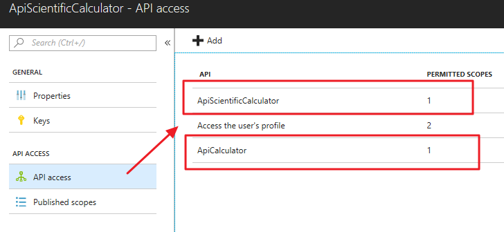

# Setup NicolAPIScientificCalculator

Objective of this API is to provide 3 "complex" operations (x^y, %, !) as authenticathed API. In order to be implemented, these APIs require calls to [Calculator Api](setup-apicalculator.md). Both API are registered as Azure B2C Applications, and we want configure averything so that this API re-use the bearer provided by the caller to authenticate the target API. **This means that we are impersonating the calling when we call the target API**.  

The configuration is very similar to ApiCalculator, so I will **highlight**  all relevant differences.

# (1) Azure B2C Configuration
Create an application on Azure B2C.

* Name: **ApiScientificCalculator**
* WebApp/Include WebAPI: **YES**
* WebApp/allow Implicit Flow: **YES**
* Reply URL: **https://jwt.ms** 

After creating it, select "Api access". Click the "Add" button. In the next blade, add both ApiCalculator and ApiScientificCalculator) this will allow to call with the same authorization bearer both ApiScientificCalculator **and** ApiCalculator.



# (2) create a ASP Net Core API not authenticated
Via visual studio create a solution of type "ASP.NET Core Web Application", type API, with NO Authentication


# (2) Create a ASP Net Core API not authenticated
Via Visual Studio create a solution of type "ASP.NET Core Web Application", type API, with NO Authentication.

# (3) Create a policy: B2C\_1\_signin-default
**You don't need to create an additional policy, just use the policy already created** (B2C_1_signin-default).

# (4) Configure appsettings.json and solution for authentication

In appsettings.config add the following information:

	"AzureAdB2C": {
	"Tenant": "nicolb2c.onmicrosoft.com",
	"ClientId": "<the application id (guid)>",
	"Policy": "B2C_1_signin-default"
	},

also add following NuGet packages to the solution

	Microsoft.AspNetCore.Authentication.JwtBearer
	Microsoft.AspNetCore.Mvc
	Microsoft.Extensions.Configuration.UserSecrets
	Microsoft.Extensions.SecretManager.Tools

# (5) Update the code 

Update [program.cs](nicold.playground/nicold.APICalculator/program.cs) and [startup.cs](nicold.playground/nicold.APICalculator/startup.cs) as shown in this repository, then create a controller for the home page [Controllers/HomeController.cs](nicold.playground/nicold.APICalculator/Controllers/HomeController.cs) with the corresponding view [View/Home/index.shtml](nicold.playground/nicold.APICalculator/View/Home/index.shtml).

It is now the time to build the real API. We will implement the API with the controller [Controllers/CalcController.cs](nicold.playground/nicold.APIScientificCalculator/Controllers/CalcController.cs)****

The sequence of operation needed to authenticate the API is similar to APICalculatator. The interesting part is the API to API portion of the code.
Here the main attention points:

### Make the Get Asyncronous
 	public async Task<IActionResult> Get(string op, [FromQuery] double param1, [FromQuery] double param2)

### Get the Bearer from the context
	var header_bearer = HttpContext.Request.Headers["Authorization"];
    string bearer = header_bearer.FirstOrDefault().Split(" ")[1];

### Use it to call ApiCalculator
	string CALL_MULTIPLY = "http://nicolapicalculator.azurewebsites.net/api/calc/sum?param1={0}&param2={1}";
	
	_client.DefaultRequestHeaders.Accept.Clear();
    _client.DefaultRequestHeaders.Authorization = new AuthenticationHeaderValue("Bearer", bearer);

    var httpResponse = await _client.GetAsync(string.Format(CALL_MULTIPLY, param1, param2));

# (6) Update to APIScientificCalculator to avoid ValidateAudience check

By default Microsoft.AspNetCore.Authentication.JwtBearer middleware verifies if the token and the API audience match. This means that in a cross API call, that happens when WebCalculator calls ApiScientificCalculator using the same bearer, you will receive the following message:

	AuthenticationFailed: IDX10214: Audience validation failed. Audiences: '<guid>'. Did not match: validationParameters.ValidAudience: '<guid>' or validationParameters.ValidAudiences: 'null'.

This because both clientid "WebCalculator" and clientid "APIScientificCalculator" want to access to same API (APICalculator).

In order to avoid this, in calculatorAPI>Startup>ConfigureServices you need to add the following

```csharp
var tokenValidationParameters = new TokenValidationParameters
         {
             RequireExpirationTime = true,
             RequireSignedTokens = true,
             SaveSigninToken = false,
             ValidateActor = false,
             ValidateAudience = false, // default WAS TRUE
             ValidateIssuer = true,
             ValidateIssuerSigningKey = false,
             ValidateLifetime = true
         };
```

and the following

```csharp
.AddJwtBearer(jwtOptions =>
              {
                  jwtOptions.Authority = $"https://login.microsoftonline.com/tfp/{Configuration["AzureAdB2C:Tenant"]}/{Configuration["AzureAdB2C:Policy"]}/v2.0/";
                  jwtOptions.Audience = Configuration["AzureAdB2C:ClientId"];
                  jwtOptions.TokenValidationParameters = tokenValidationParameters; // ADD THIS LINE TOO
                  jwtOptions.Events = new JwtBearerEvents
                  {
                      OnAuthenticationFailed = AuthenticationFailed
                  };
              });
```

where you are telling "dear middlewhere, please do not validate Audience on each call":)

# Retrieve the bearer and call the API
That's all. In order to call the API, you can go to Azure Portal > Azure B2C > Policies > Sign-up or Sign-In User Policy > B2C_1_signin-default


* Application: **ApiScientificCalculator**
* ReplyURL: **https://jwt.ws**

Click [RUN NOW], copy the bearer from the page and use it in Postman.


